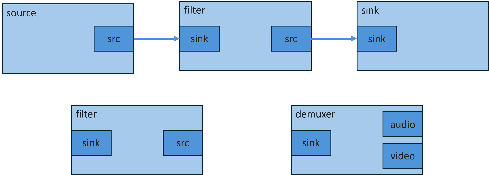

# 3. GStreamer의 아키텍처

## ⁉️파이프 라인 구조

* GStreamer의 핵심은 파이프라인(pipeline)
* 파이프라인은 데이터 흐름을 관리
* 여러 요소(elements)를 연결하여 미디어 데이터를 처리
* 각 요소(elements)는 특정 기능을 수행하며, 파이프라인 내에서 데이터를 순차적으로 처리

***

## ⁉️요소(Element), 패드(Pad), 플러그인(Plugin)의 개념

* **요소(Element)**
  * GStreamer의 기본 구성 단위로, 미디어 처리의 특정 기능을 담당
  * ex) 소스(source), 필터(filter), 싱크(sink) 등이 있습니다.

<figure><figcaption></figcaption></figure>

* **패드(Pad)**
  * 요소 간의 데이터 통신을 위한 인터페이스
  * 입력 패드(sink pad)와 출력 패드(src pad)로 구분.
  * src와 sink를 연결하는 부분은 link.
  * 데이터는 출력 패드를 통해 나가고, 입력 패드를 통해 들어옵니다.
  * src와 sink 에서 서로 보내는 data type을 정하며 그 부분이 맞는 경우에 link가 성공적으로 연결됐다고함.
  * Data는 보통 Buffer의 형태로 옮겨짐. (GstBuffer)

<figure><figcaption></figcaption></figure>

* **플러그인(Plugin)**
  * GStreamer의 기능을 확장하는 모듈로, 다양한 요소들을 포함.&#x20;
  * 플러그인은 동적으로 로드되어 GStreamer의 기능을 확장.
  * 다양한 미디어 포맷과 코덱을 지원.

***

## ⁉️플러그인 아키텍처 및 모듈화

* 주요 특징
  * **모듈화(Modularity):** GStreamer는 다양한 기능을 플러그인 형태로 분리하여 관리한다. 각 플러그인은 특정한 미디어 형식의 디코딩, 인코딩, 필터링 등의 기능을 수행하며, 필요에 따라 추가하거나 제거할 수 있다.
  * **동적 로딩(Dynamic Loading):** 플러그인은 실행 시 동적으로 로드되며, 이를 통해 애플리케이션은 필요한 기능만을 선택적으로 사용할 수 있다. 이러한 동적 로딩 메커니즘은 시스템 자원의 효율적인 활용을 가능하게 한다.
  * **확장성(Extensibility):** 새로운 미디어 형식이나 기능이 필요할 경우, 해당 기능을 구현한 플러그인을 추가하여 GStreamer의 기능을 확장할 수 있다. 이를 통해 최신 미디어 기술에 대한 지원을 신속하게 추가할 수 있다.
* 플러그인의 분류: 기능과 안정성에 따라 여러 세트로 분류되며, 각 세트는 특정한 특성을 지닌다.
  * **Good:** 높은 품질과 안정성을 가진 플러그인 세트로, LGPL 라이선스 하에 배포.
  * **Bad:** 기능은 유용하지만, 코드 리뷰나 문서화, 테스트 등이 부족하여 아직 완전한 안정성에 도달하지 못한 플러그인 세트.
  * **Ugly:** 기술적으로는 양호하지만, 라이선스 문제로 인해 배포에 제약이 있을 수 있는 플러그인 세트.

