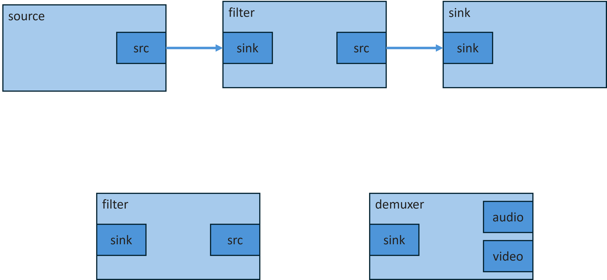

# HDR

## ⁉️HDR이란 무엇입니까?

* High Dynamic Range
* 이미지 내의 밝은 부분과 어두운 부분의 차이를 극대화시킨 영상을 구현하는 포괄적인 기술을 의미
* 특정 이미지에서 표현된 가장 밝은 부분과 가장 어두운 부분의 차이를 의미

***

## SDR과 HDR의 차이점

| **항목**    | 
<strong>SDR</strong>

<strong>(Standard Dynamic Range)</strong>
 | 
<strong>HDR</strong>

<strong>(High Dynamic Range)</strong>
 |
| --------- | --------------------------------------------------------------------------- | ----------------------------------------------------------------------- |
| **밝기 범위** | 최대 약 100 [니트(nits)](hdr/nits.md)로 제한됨.                                      | 최대 약 1,000\~10,000 니트(nits)까지 확장됨.                                      |
| **색상 깊이** | 8비트 색상 깊이로 약 1,670만 가지 색상 표현.                                               | 10비트 이상의 색상 깊이로 수십억 가지 색상 표현.                                           |
| **색 영역**  | [Rec.](hdr/rec..md) 709/sRGB 색 공간 사용.                                       | Rec. 2020 색 공간 사용으로 더 넓은 색 영역 표현.                                       |
| **명암 대비** | 제한된 명암 대비로 인해 밝은 부분과 어두운 부분의 디테일 표현에 한계가 있음.                                | 밝은 부분과 어두운 부분 모두에서 더 많은 디테일과 깊이 있는 명암 대비 표현.                            |
| **표현력**   | 현실감 있는 이미지 표현에 제한이 있음.                                                      | 현실감 넘치는 이미지와 비디오 표현 가능.                                                 |
| **호환성**   | 대부분의 기존 디스플레이와 콘텐츠가 SDR로 제작됨.                                               | _HDR 콘텐츠는 HDR 지원 디스플레이에서만 최적의 품질로 감상 가능._                               |

***

## ⁉️고화질의 5가지 요소

<figure><figcaption></figcaption></figure>

1.  해상도\_8K

    <figure><figcaption>
[ 해상도의 차이] 
</figcaption></figure>

    * 이미지의 픽셀 수
    * 4K UHD 해상도는 3840x2160으로 표준 FHD에 비해 4배의 이미지 데이터가 표시
    * ex) 해상도 비교

    <figure><figcaption></figcaption></figure>
2.  비트 수 (12 bit)

    <figure><figcaption>
[ 비트수의 차이 ]
</figcaption></figure>

    * 1초에 표시되는 이미지 수
    * 필름은 일반적으로 24p (초당 24 프레임)로 촬영되는 반면 표준 TV는 일반적으로 60i 또는 30p(초당 30프레임)로 실행
    * 8K 방송을 위한 BT.2020 표준은 현실 세계만큼 부드럽게 움직이는 최대 120p의 프레임 속도에 대한 정의를 포함
3.  프레임 속도 (60p/120p)

    <figure><figcaption>
[ 프레임 속도별 차이 ]
</figcaption></figure>

    * 1초에 표시되는 이미지 수
    * 필름은 일반적으로 24p (초당 24 프레임)로 촬영되는 반면 표준 TV는 일반적으로 60i 또는 30p(초당 30프레임)로 실행
    * 8K 방송을 위한 BT.2020 표준은 현실 세계만큼 부드럽게 움직이는 최대 120p의 프레임 속도에 대한 정의를 포함
4.  색 영역 (Rec.2020) = 색 선명도

    <figure><figcaption>
[ 색 영역의                                                                                           차이 ]
</figcaption></figure>

    * 표시 할 수 있는 모든 색상의 범위
    * 아래 표는 사람의 눈으로 감지 할 수있는 모든 RGB 값의 범위
    * 각각의 Rec. 삼각형은 색 영역을 표시
5.  밝기 (HDR) = 이미지 조명의 강도

    <figure><figcaption></figcaption></figure>

    * 표시 할 수 있는 이미지 조명의 강도 범위
    * 인간의 눈이 인식 할 수 있는 가장 어두운 물체와 가장 밝은 물체 사이의 차이는 일반적으로 10¹²로 알려져
    * 일반적인 디스플레이 장치는 10³까지의 범위만을 표시
    * HDR은  10⁵ 까지 확장하여, 인간의 눈이 인식 하는 것과 훨씬 가까운 방식으로 빛과 그림자를 표현

